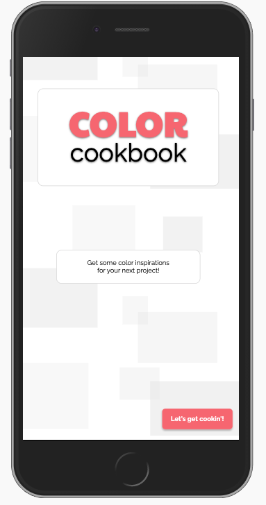
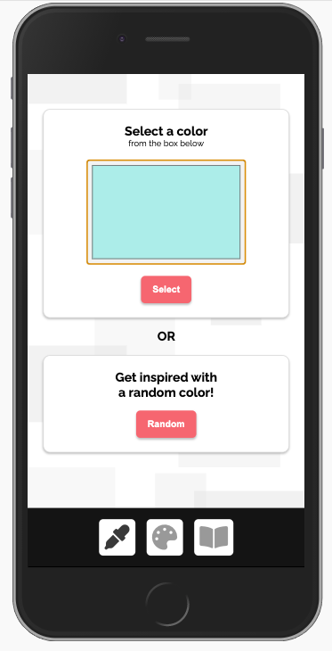
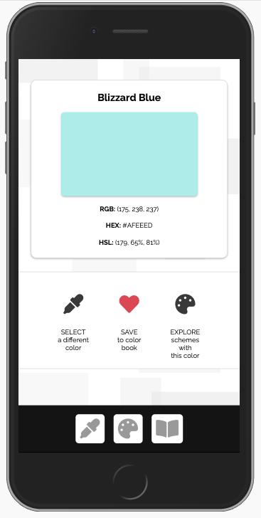
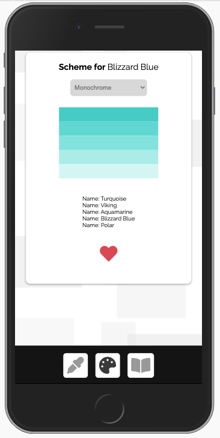
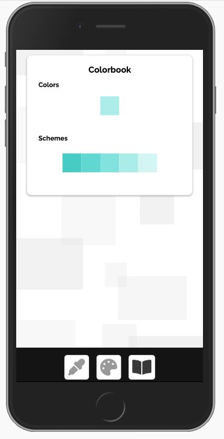

# Color Cookbook

## About the App
Color Cookbook is an application for anyone who wants to be able to save colors, color schemes, or create custom color schemes for a project to reference later on.

## Current Features
1. Users can select a color of choice and useful information about the colored will be displayed (information such as the name, HEX, RGB or HSL value of hte color). Let's just say, what if the user doesn't have a color in mind? The app will display a random color for the user if they choose to select a randomly.
2. Users can view different color schemes of the color of their choice. Color schemes include monochrome, monochrome dark/light, analogic, analogic-complement, and quad.
3. Users can save the color and the color scheme of their choice. This information is saved to the user's local storage.
4. Users can view the saved colors and color schemes.

## Preview

## Planned Additions
* Users should be able to click on saved colors and schemes to access the information of the colors.
* Users should be able to create their own custom color schemes and save them.
